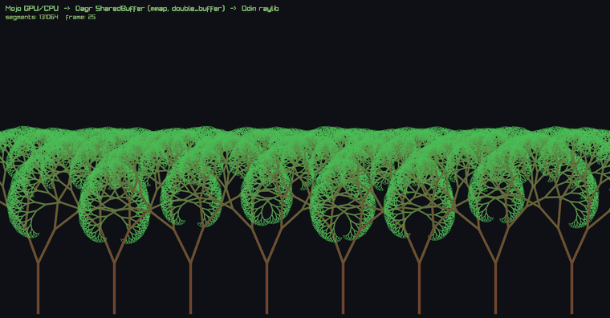

# Dagr SharedBuffers — cross-language, cross-process IPC (Mojo GPU → Odin raylib)

Two programs, written in **two different languages**, running as **two separate OS
processes**, share **one block of memory** and pass live animation frames back and
forth with **zero serialization**:

- **Process A — Mojo, on the GPU** computes an animated fractal forest and
  *publishes* each frame.
- **Process B — Odin, with raylib** reads the newest frame and *renders* it at
  60 fps.

They never send messages or copy a serialized buffer. They agree on a **fixed
memory layout** and take turns through a lock-free handshake — that's the whole
point of a Dagr **`SharedBuffer`**.



*Left process (Mojo, GPU) computes the forest and publishes each frame; right process (Odin, raylib) reads and draws it — sharing one `mmap`'d region, no serialization. Recorded straight from the running demo.*

## Why this works: fixed-layout SharedBuffers

Dagr is a binary format for data graphs. A **`SharedBuffer`** is its fixed-layout
flavour: every field sits at a compile-time-known byte offset, so reading or writing
a field is **pure offset arithmetic** — no varint decoding, no allocation, no
deserialization step. Two consequences make this demo possible:

1. **A GPU kernel can fill the buffer in place.** Offsets are constants, so a Mojo
   kernel writes branch coordinates straight into the region through the generated
   overlay.
2. **Two languages/processes agree on the bytes exactly.** The Mojo overlay and the
   Odin overlay are generated from the *same* schema, so whatever one process writes,
   the other reads with no marshalling in between.

The schema — one `SharedBuffer` called `Forest` — lives in
[`forest_schema.py`](forest_schema.py).

## The handshake: `double_buffer`

A renderer must never see a half-written frame, and it must never make the producer
wait. The `Forest` buffer uses Dagr's **`double_buffer`** concurrency strategy: the
region holds a small atomic control word plus **three** frame slots. The producer
fills an off-screen slot and publishes it with a single atomic exchange; the
consumer always latches the newest *completed* slot and never tears or retries. It's
a classic single-producer / single-consumer triple buffer — and here the producer
and consumer are **different languages in different processes**, coordinating purely
through the shared bytes.

## What the GPU computes

A fractal tree is usually built by recursion, but here every branch is computed
**independently and in parallel**: each GPU thread takes one branch index, decodes
it into a root-to-branch path (the bits of the index pick left/right at each level),
and walks that path to a world transform. Add a time-varying wind term that grows
with depth and the whole forest sways coherently — the trunks stay put, the canopy
moves. A forest of 16 trees at depth 13 is **131,056 line segments**, recomputed every
single frame.

(`TREES` and `TREE_DEPTH` are pure-API schema constants — they don't affect the wire
layout, which is fixed by `SEG_CAP`. So going from 8 deep trees to 16 shallower ones
is just two numbers in the schema: the overlays regenerate, the producer and renderer
rebuild unchanged, and the buffer stays byte-compatible.)

The producer also places the trees for depth: each is given a distance, so farther
ones are smaller, sit higher, and are packed back-to-front in the array. The renderer
draws them in that order (near trees occlude far ones) and fades each tree toward a
blue-grey haze by its distance — atmospheric perspective, with no extra data in the
buffer (it re-derives a segment's tree from its index, since `TREES`/`TREE_DEPTH` are
shared schema constants).

## Run it

```bash
pixi install        # fetch the Mojo/MAX toolchain (first time only)
pixi run demo       # or: ./run_demo.sh
```

Close the render window (or press **ESC**) to end the demo; the producer is stopped
automatically. The window is **resizable** — the forest is letterboxed to fit any
size, so it scales cleanly without distorting.

**GPU or CPU.** The producer computes the forest on the **GPU** when a device is
present and falls back to the **CPU** otherwise — the exact same per-branch function
runs on a GPU thread or in a host loop. You can also force a backend:

```bash
pixi run demo cpu       # force CPU                    (or: ./run_demo.sh cpu)
pixi run demo gpu       # force GPU                    (or: ./run_demo.sh gpu)
pixi run demo gpu-copy  # force the copying GPU path   (or: ./run_demo.sh gpu-copy)
```

(CPU and GPU output match to sub-pixel precision — max ~7e-4 px over the whole
forest. The two GPU backends are bit-identical to each other.)

At ~131k segments the backends pull apart (measured per-frame compute on an M4 Max,
sleep removed):

| Backend | per frame | throughput |
|---|---|---|
| **CPU** (single-threaded loop) | ~8.6 ms | ~116 fps |
| **GPU** (kernel + copy back to the slot) | ~0.44 ms | ~2,280 fps |

So the GPU is **~19×** faster here — and both still clear the demo's 60 fps. (At the
original 12k segments the gap was only ~1.9× — the bigger the forest, the more the
parallel GPU pulls ahead.)

### Zero-copy on NVIDIA: the GPU writes the shared region itself

A discrete NVIDIA GPU does not have to stage the frame in VRAM first. When the
driver reports `CU_DEVICE_ATTRIBUTE_PAGEABLE_MEMORY_ACCESS`, a kernel can
dereference an ordinary host virtual address — **including a file-backed
`MAP_SHARED` mapping**. So the producer hands the whole mmap'd region to the device
as a non-owning `HostBuffer` and the kernel writes each branch **straight into the
off-screen slot the Odin renderer will read**. No device buffer, no H2D, no D2H, no
memcpy — the bytes are written once, by the GPU, in the place both processes share.

The producer picks this automatically and falls back to the copying path (`gpu-copy`)
on any device that cannot address host memory — Metal, or a CUDA device without
pageable access — so the demo still runs everywhere.

Measured on an RTX 4050 Laptop GPU (Linux, sleep removed, 500 timed frames after 20
warm-up frames, 131,056 segments = a 2.23 MB node per frame):

| Backend | per frame | throughput |
|---|---|---|
| **CPU** (single-threaded loop) | ~12.99 ms | ~77 fps |
| **GPU + copy** (kernel into VRAM, copy to the slot) | ~0.45 ms | ~2,230 fps |
| **GPU zero-copy** (kernel writes the slot directly) | **~0.20 ms** | **~5,100 fps** |

Zero-copy is **2.3× faster than copying** and **66× faster than the CPU**. Timing the
copying backend's two stages separately shows where that 0.25 ms goes:

| `gpu-copy` stage | per frame |
|---|---|
| kernel + `synchronize()` (writing VRAM) | ~0.025 ms |
| `map_to_host()` + `memcpy` into the slot | ~0.45 ms |

**~95% of the copying path's frame time is data movement, not compute.** Writing to
host memory over PCIe does make the kernel itself ~8× slower (0.20 ms vs 0.025 ms),
but that is still far cheaper than staging the node in VRAM and paying for the
transfer afterwards: ~11.4 GB/s written once, versus ~5 GB/s for the D2H + memcpy
round trip.

**One catch worth knowing about.** Zero-copy only pays off if the kernel's stores are
*naturally aligned*. An `alignment=1` store lowers to per-byte stores, and over PCIe
each byte becomes its own transaction — VRAM barely notices, host memory falls off a
cliff:

| Kernel stores, 2.2 MB node | to device VRAM | to host memory |
|---|---|---|
| `alignment=1` | 263 GB/s | **0.03 GB/s** |
| naturally aligned | 272 GB/s | **12.9 GB/s** |

That 430× gap is the difference between zero-copy being ~2.3× faster than copying and
being ~200× slower. The SharedBuffer codegen handles it: for an array declared
`aligned(64)` it emits the field's *natural* alignment, so `set_x0_unchecked()` on an
f32 array is an `alignment=4` store — a single aligned transaction — while packed
scalar fields still get the conservative `alignment=1` they need. So `write_branch()`
writes through the plain `set_*_unchecked()` accessors and lands on the fast row of
that table; the CPU and copying paths get the same aligned stores for free.

**Requirements**

- The **Mojo / MAX toolchain**, via [pixi](https://pixi.sh) — see [`pixi.toml`](pixi.toml).
- A **GPU** for the GPU path — an **NVIDIA GPU** (CUDA; gets the zero-copy backend)
  or an **Apple Silicon GPU** (Mojo's Metal stack; gets the copying backend).
  Optional — the producer runs on the CPU without one.
- The **[Odin](https://odin-lang.org) compiler**, which bundles `vendor:raylib` (no
  separate raylib install needed).

## How the pieces fit

```
  forest_schema.py                     ← one schema, the source of truth
        │  dagr build  (see note below)
        ├────────────► ForestSharedBuffer.mojo   ← Mojo overlay (producer)
        └────────────► forest_sb/                ← Odin overlay package (renderer)

  producer.mojo  ──GPU or CPU──►  branches ──►  ┌─────────────────────┐
                    (on NVIDIA the kernel     │  mmap'd region      │
                     writes these slots ─────►│  [ctrl][slot0..2]   │
                     directly — no copy)      │                     │
                        commit() atomic ─────►│                     │
                                              └─────────┬───────────┘
  renderer.odin  ◄──raylib──  latest frame  ◄──consumer_read()──┘
```

- [`producer.mojo`](producer.mojo) — `mmap`s the region and each frame fills an
  off-screen slot with the fractal forest (on the **GPU** via a one-thread-per-branch
  kernel — writing the slot directly where the device can reach host memory, else
  into a device node that is copied over — or the **CPU** via the same function in a
  host loop) and `commit()`s it (one atomic exchange). Runs until stopped.
- [`renderer.odin`](renderer.odin) — `mmap`s the same region, and each frame latches
  the newest published slot and draws every branch with raylib (colour + thickness
  by depth). Trunks and major limbs are thick anti-aliased quads; the ~130k fine
  branches are streamed as one batched `rlgl` GL-line pass (chunk-flushed so none are
  dropped) — which renders the whole forest at ~120 fps instead of ~85.
- [`forest_sb/`](forest_sb) — the generated Odin overlay package the renderer
  imports.
- [`ForestSharedBuffer.mojo`](ForestSharedBuffer.mojo) — the generated Mojo overlay
  the producer imports.

The two processes find each other through a fixed file path
(`/tmp/dagr_forest_ipc.bin`) that they both `mmap`.

## About the generated overlays (and the Dagr CLI)

The Mojo overlay and the Odin overlay package are **generated** from
[`forest_schema.py`](forest_schema.py) by the **Dagr CLI**:

```bash
dagr build --schema forest_schema.py
```

> **The Dagr CLI is currently in private beta and not publicly available.**
> So that anyone can build and run this demo without it, the generated overlays are
> **committed to this repo**, and the `dagr build` step in `run_demo.sh` is left
> commented out. Nothing else depends on the CLI.
>
> Interested in trying the Dagr CLI? **Open an issue on this repo** and I'll get in
> touch.

## Notes & scope

- **One producer, one consumer, synchronous-ish.** `double_buffer` is a single-writer
  / single-reader strategy; the atomic control word is the only coordination. Neither
  side ever blocks the other.
- **The GPU-friendly slice of Dagr.** The buffer stores 64-byte-aligned numeric arrays
  (branch endpoints as `f32`, depth as `u8`). Bit-packed and pointer/reference fields
  are deliberately out of scope on-device.
- **One source of truth for the parameters.** The forest's numbers (`TREES`,
  `TREE_DEPTH`, `WORLD_W/H`, sway tuning) and the shared-region `PATH` are declared
  once as **SharedBuffer `constants`** in `forest_schema.py`. The Dagr CLI emits them
  as compile-time constants into *both* overlays, so the Mojo producer and the Odin
  renderer read the same values — nothing is hand-copied between the two languages.

## Related

- **[Dagr SharedBuffers — cross-language FFI & GPU example](https://github.com/mzaks/dagr-shared-buffers-ffi-and-gpu-example)**
  — the same fixed-layout idea *within* a single process: a Mojo GPU kernel drives a
  SharedBuffer in place and hands the bytes to Rust over a C-ABI FFI (both directions),
  with a synchronous `none` hand-off instead of this repo's cross-process
  `double_buffer`.
